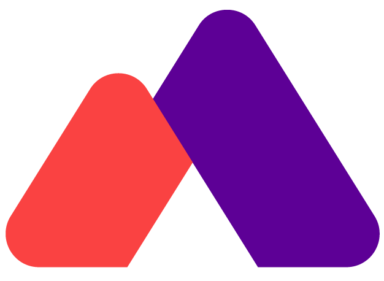

[![Contributors][contributors-shield]][contributors-url]
[![Forks][forks-shield]][forks-url]
[![Stargazers][stars-shield]][stars-url]
[![Issues][issues-shield]][issues-url]

<!-- PROJECT LOGO -->
 

 

  <h3 align="center">LillyTrecker</h3>

  

    Insert Description Here
     
    <a href="https://github.com/isaiahmcnealy/LillyTrecker"><strong>Explore the docs »</strong></a>
     
     
    <a href="https://github.com/isaiahmcnealy/LillyTrecker">View Demo</a>
    ·
    <a href="https://github.com/isaiahmcnealy/LillyTrecker/issues/new">Report Bug</a>
    ·
    <a href="https://github.com/isaiahmcnealy/LillyTrecker/issues/">Request Feature</a>
  

<!-- TABLE OF CONTENTS -->

  
Table of Contents

  <ol>
    <li>
      <a href="#about-the-project">About The Project</a>
      <ul>
        <li><a href="#built-with">Built With</a></li>
      </ul>
    </li>
    <li>
      <a href="#getting-started">Getting Started</a>
      <ul>
        <li><a href="#prerequisites">Prerequisites</a></li>
        <li><a href="#installation">Installation</a></li>
      </ul>
    </li>
    <li><a href="#usage">Usage</a></li>
    <li><a href="#roadmap">Roadmap</a></li>
    <li><a href="#contributing">Contributing</a></li>
    <li><a href="#license">License</a></li>
    <li><a href="#contact">Contact</a></li>
    <li><a href="#acknowledgments">Acknowledgments</a></li>
  </ol>

<!-- ABOUT THE PROJECT -->
## About The Project

// TODO: Add detailed about project section here 

(<a href="#top">back to top</a>)

### Built With

* [Swift](https://developer.apple.com/swift/)

(<a href="#top">back to top</a>)

<!-- GETTING STARTED -->
## Getting Started

To get a local copy up and running follow these simple example steps...

### Prerequisites

This is an example of how to list things you need to use the software and how to install them.
* Internet Connection
* Xcode
* iOS Device - mobile

<!-- USAGE EXAMPLES -->
## Usage

Use this space to show useful examples of how a project can be used. Additional screenshots, code examples and demos work well in this space. You may also link to more resources.

_For more examples, please refer to the [Documentation](url to usefull documentation)_
<!-- _For more examples, please refer to the [Documentation](http://isaiahmcnealy.com/projects/OpenStreetMap_Route_Planner)_ -->

(<a href="#top">back to top</a>)

<!-- ROADMAP -->
## Roadmap

- [x] Create GitHub Repo
- [x] Add Readme
- [ ] Create Logo
- [ ] Import Figma Design
- [ ] Create main page
  - [ ] Import Videos
  - [ ] Stream Videos to page
- [ ] Add record & post feature
- [ ] Add like feature
- [ ] Add comment feature
- [ ] Create GIF & Update ReadMe 

See the [open issues](https://github.com/isaiahmcnealy/LillyTrecker.git) for a full list of proposed features (and known issues).

(<a href="#top">back to top</a>)

<!-- CONTRIBUTING -->
## Contributing

If you have a suggestion that would make this better, please fork the repo and create a pull request. You can also simply open an issue with the tag "enhancement".
Don't forget to give the project a star! Thanks again!

1. Fork the Project
2. Create your Feature Branch (`git checkout -b feature/AmazingFeature`)
3. Commit your Changes (`git commit -m 'Add some AmazingFeature'`)
4. Push to the Branch (`git push origin feature/AmazingFeature`)
5. Open a Pull Request

(<a href="#top">back to top</a>)

<!-- ACKNOWLEDGMENTS -->
## Acknowledgments

Use this space to list resources you find helpful and would like to give credit to. I've included a few of my favorites to kick things off!

* [Choose an Open Source License](https://choosealicense.com)
* [GitHub Emoji Cheat Sheet](https://www.webpagefx.com/tools/emoji-cheat-sheet)
* [Img Shields](https://shields.io)
* [GitHub Pages](https://pages.github.com)
* [Font Awesome](https://fontawesome.com)
* [React Icons](https://react-icons.github.io/react-icons/search)

(<a href="#top">back to top</a>)

<!-- MARKDOWN LINKS & IMAGES -->
<!-- https://www.markdownguide.org/basic-syntax/#reference-style-links -->
[contributors-shield]: https://img.shields.io/github/contributors/isaiahmcnealy/LillyTrecker.svg?style=for-the-badge
[contributors-url]: https://github.com/isaiahmcnealy/LillyTrecker/graphs/contributors
[forks-shield]: https://img.shields.io/github/forks/isaiahmcnealy/LillyTrecker.svg?style=for-the-badge
[forks-url]: https://github.com/isaiahmcnealy/LillyTrecker/network/members
[stars-shield]: https://img.shields.io/github/stars/isaiahmcnealy/LillyTrecker.svg?style=for-the-badge
[stars-url]: https://github.com/isaiahmcnealy/LillyTrecker/stargazers
[issues-shield]: https://img.shields.io/github/issues/isaiahmcnealy/LillyTrecker.svg?style=for-the-badge
[issues-url]: https://github.com/isaiahmcnealy/LillyTrecker/issues
[license-shield]: https://img.shields.io/github/license/isaiahmcnealy/LillyTrecker.svg?style=for-the-badge
[license-url]: https://github.com/isaiahmcnealy/LillyTrecker/blob/master/LICENSE.txt
